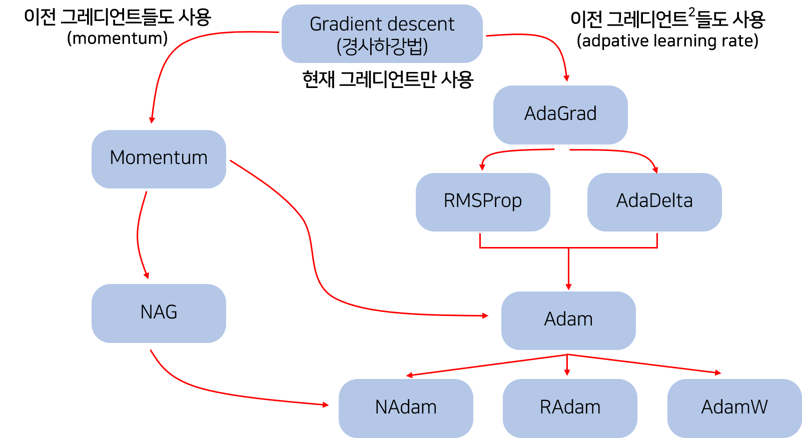

# Optimizer

### Gradient Descent (GD)

- 해당 값의 Gredient의 역방향으로 조금씩 이동하며 Loss minimum을 찾는 과정
- 전체 Training dataset을 사용 = Full batch ⇒ 계산량↑ 최솟값 도달 시간↑

### Stochastic Gradient Descent(SGD)

- GD방법을 사용하되 전체 데이터의 일부 (mini batch)만을 사용하여 Loss function calculation time을 줄인 방법
- 일부 Training dataset을 사용 = Mini batch ⇒ 계산량↓ Step 수↑
- GD에 비해서 학습 안정도는 낮다.

### Momentum

- 과거에 이동했던 방식을 현재 gradient를 통해 기억하면서 그 방향으로 어느 정도 추가 이동하는 방식
- Local minimum에 갇히는 문제를 해결할 수 있음
- 최적화 알고리즘은 아니지, 여러 최적화 알고리즘에 두루 쓰인다.
- 수렴 지점에서 요동치는 현상이 있다.

$$
v_t = \gamma v_{t-1} + \eta \bigtriangledown_{\theta_t}J(\theta_t), \theta_{t+1} = \theta_t +v_t
$$

### Nesterov accelerated gradient(NAG)

- 현재의 momentum + 미래의 momentum
- Momentum은 과거와 현재의 momentum이 같은 경우 계속해서 직진하는 성질이 있기에 미래의 모멘텀을 예측해서 현재의 모멘텀 & 가중치 변화에 적용
- SGD가 관성에 의해 수렴 지점에서 요동하는 것을 방지한다.

$$
v_t = \gamma v_{t-1} + \eta \bigtriangledown_{\theta_t}J(\theta_t-\gamma v_{t-1}), \theta_{t+1} = \theta_t +v_t
$$

## Adaptive 방식

: 파라미터에 따라 Learning rate 조절이 다른 Optimization 알고리즘

### Adaptive Gradient (AdaGrad)

- 많이 변하지 않은 가중치 (sparse parameter) → larger step size
작은 h → 큰 W 변화
많이 변한 가중치, 자주 등장한 가중치 (less sparse parameters) → smaller step size
큰 h → 작은 W 변화
- 적게 변화한 가중치를 빠르게 움직여 Loss 값을 줄이려는 시도다.
- 레이어 크기가 큰 신경망이나, sparse parameter의 경우에 성능이 좋다.
- 계속 진행하면 step size가 너무 줄어들어서, 가중치 갱신이 거의 되지 않는 경지가 된다.

$$
h ← h+ (\frac {\delta L}{\delta W})^2,\space W \leftarrow W-\eta\frac{1}{\sqrt h}\frac {\delta L}{\delta W}
$$

### Adaptive Delta(Adadelta)

- Adagrad : 모든 그래디언트 누적 → 단조로운 학습률 감소
- AdaDelta: 이전 w(window)개의 gradient만을 기억 → weight 변화량↑ → 빠른 학습

### RMSprop (Root Mean Square Propagation)

- AdaGrad에서 h를 다음과 같은 식으로 바꿔, 학습이 진행될 수록 가중치 변화가 거의 되지 않는 문제 해결.
- 오래된 h 정보는 점점 적게 반영되게 하여, 현재의 경향을 잘 반영할 수 있게 된다.
- 주로, γ = 0.9

$$
h ← \gamma h+ (1-\gamma) (\frac {\delta L}{\delta W})^2
$$

### Adam(Adaptive Moment estimation)

- RMSProp + Moment의 개념
    - Moment : 확률변수 X의 n차 moment = E[X^n]
    - 1차 moment E[X] → 모평균
    - 2차 moment E[X^2] + 1차 moment → 모분산
    - 모수이기 때문에 실제로는 알 수가 없어 표본평균과 표본제곱의 평균으로 1,2차 moment를 추정한다.(Estimation)
    
    $$
    m_t = \beta_1m_{t-1} + (1-\beta_1)g_t \\ v_t = \beta_2v_{t-1} + (1-\beta_2)g_t^2
    $$
    
    - $m_t$ : 그래디언트의 1차 모먼트 (평균)
    - $v_t$ : 그래디언트의 2차 모먼트 (분산)
    
    $$
    \theta_{t+1} = \theta_t - \frac \eta {\sqrt {\hat{v_t}}+\epsilon}\hat{m_t}
    $$
    

---

### 출처

[https://towardsdatascience.com/learning-rate-schedules-and-adaptive-learning-rate-methods-for-deep-learning-2c8f433990d1](https://towardsdatascience.com/learning-rate-schedules-and-adaptive-learning-rate-methods-for-deep-learning-2c8f433990d1)

[https://mole-starseeker.tistory.com/48](https://mole-starseeker.tistory.com/48)

[https://hiddenbeginner.github.io/deeplearning/2019/09/22/optimization_algorithms_in_deep_learning.html](https://hiddenbeginner.github.io/deeplearning/2019/09/22/optimization_algorithms_in_deep_learning.html)